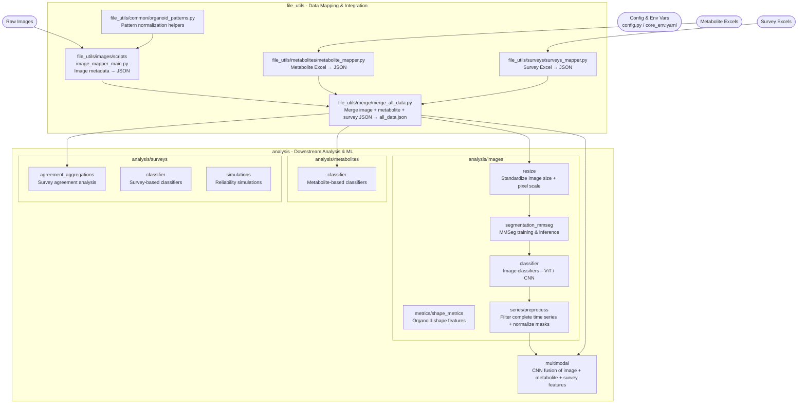

# Promega Organoid Analysis System

This repository contains a comprehensive system for analyzing organoid quality using multimodal data including images, metabolites, and survey assessments for time series prediction.

## Project Structure



## Quick Start

### 1. Environment Setup
```bash
# The conda environment is located at:
/net/projects2/promega

# You don't need to activate it manually - the SLURM scripts will use it
```

### 2. Generate Master Data File
```bash
# From the project root directory, run:
cd /home/YOUR_GITHUB_NAME/MINITEST_DIRECTORY  # Replace with your actual path
/net/projects2/promega/bin/python file_utils/merge/merge_all_data.py

# This generates all_data.json with 5,168+ merged records
# Output: /net/projects2/promega/data-analysis/output/all_data.json
```

### ⚠️ IMPORTANT: Update Paths Before Running Analysis

**Before submitting any jobs**, you must update the hardcoded paths in the SLURM scripts to match your setup:

Replace `/home/tonyluo/minitest` with `/home/YOUR_GITHUB_NAME/YOUR_MINITEST_DIRECTORY` in:

1. **`analysis/images/classifier/run_accuracy.s`**
   - Line 13: `PROJ_ROOT=/home/YOUR_GITHUB_NAME/YOUR_MINITEST_DIRECTORY`

2. **`analysis/surveys/classifier/run_survey_classifier.s`**
   - Line 12: `PROJ_ROOT=/home/YOUR_GITHUB_NAME/YOUR_MINITEST_DIRECTORY`

Example:
```bash
# If your username is jsmith and you cloned to /home/jsmith/promega-analysis
# Change: PROJ_ROOT=/home/tonyluo/minitest
# To:     PROJ_ROOT=/home/jsmith/promega-analysis
```

### 3. Run Analysis on GPU Computation Nodes

**Important**: Analysis must be run on computation nodes (not login nodes) using SLURM job submission.

#### 3a. Image Classifier (GPU Required)
```bash
# Navigate to classifier directory
cd /home/YOUR_GITHUB_NAME/MINITEST_DIRECTORY/analysis/images/classifier

# Submit the training job to SLURM
sbatch run_accuracy.s

# Monitor job status
squeue -u $USER

# Check logs
tail -f logs/soft-label_<JOBID>.out
```

The image classifier will train models for each day (Dy3, Dy6, Dy8, etc.) sequentially.
Results are saved in `outputs_512x384_Regular_image_with_train_augment_with_auroc/vit/DyXX/`

#### 3b. Survey Classifier (GPU Required)
```bash
# Navigate to survey classifier directory  
cd /home/YOUR_GITHUB_NAME/MINITEST_DIRECTORY/analysis/surveys/classifier

# Submit the survey classifier job
sbatch run_survey_classifier.s

# Check completion
squeue -u $USER
cat logs/survey_<JOBID>.out
```

The survey classifier trains a ResNet50V2+CNN dual-input model on Day 30 organoids using survey evaluation labels.
Results include trained model (`.h5`), training curves, and confusion matrix.

**Recent Updates** (Oct 2025):
- Now uses `all_data.json` as single data source (no separate mapping files needed)
- Computes labels directly from survey evaluations in `all_data.json`
- GPU-compatible metrics (AUC, Precision, Recall)
- See `analysis/surveys/classifier/CHANGES.md` for detailed changes

**Note**: Before submitting jobs, update the SLURM scripts:
- `analysis/images/classifier/run_accuracy.s` - Update `PROJ_ROOT` variable (line 13)
- `analysis/surveys/classifier/run_survey_classifier.s` - Update `PROJ_ROOT` variable (line 13)

## Configuration System

The system uses a centralized `config.py` file that loads configuration from environment variables. Key variables:

- `BASE_PATH` - Root directory for raw data
- `OUTPUT_FOLDER` - Location for processed outputs  
- `SURVEY_RESULTS` - Directory containing Excel survey files
- `METABOLITE_DATA_DIR` - Directory for metabolite Excel files
- `TARGET_WIDTH` / `TARGET_HEIGHT` - Image processing dimensions

Create a `.env` file in the project root with these variables set to your local paths.

## Data Processing Pipeline

1. **Individual Mappers**: Process raw data sources
   - `file_utils/images/image_mapper_main.py` - Maps image files to metadata
   - `file_utils/metabolites/metabolite_mapper.py` - Processes metabolite Excel data
   - `file_utils/surveys/surveys_mapper.py` - Processes survey Excel data

2. **Master Merger**: Combines all data sources
   - `file_utils/merge/merge_all_data.py` - Creates unified `all_data.json`

3. **Analysis**: Uses `all_data.json` as single source of truth
   - All analysis code in `analysis/` directory
   - No direct access to raw data files
   - Standardized organoid key format: `"BA1 96_1 Dy30 A1"`

## Data Structure

The `all_data.json` file contains unified organoid data with structure:
```json
{
  "BA1 96_1 Dy03 A1": {
    "dayID": "Dy03",
    "BA": "BA1 96_1", 
    "wellID": "A1",
    "day_num": 3,
    "mdl_day": 3.0,
    "Best Z Filename": "/path/to/image.tif",
    "256x192": { "img_path": "...", "mask_path": "..." },
    "512x384": { "img_path": "...", "mask_path": "..." },
    "metabolites": { "GlucoseGlo": {...}, "ATP": {...} },
    "survey": { "evaluations": [...], "quality_scores": [...] }
  }
}
```

## Key Features

- **Multimodal Data Integration**: Images, metabolites, and surveys in one structure
- **Time Series Analysis**: Organoid quality tracking across days (Dy3, Dy6, Dy8, etc.)
- **Standardized Processing**: Consistent image resolutions and metadata
- **Environment-Based Configuration**: No hardcoded paths
- **Comprehensive Analysis Tools**: Classification, segmentation, and statistical analysis

## Development Guidelines

- **Environment**: Always activate conda environment first: `conda activate /net/projects2/promega`
- **Configuration**: Use `config.py` for all path and setting management
- **Data Access**: Use `all_data.json` as single source of truth
- **Analysis Location**: Place all analysis code in `analysis/` directory
- **Execution**: Run everything from project root directory

## Current Status

✅ **Fully Functional System** (Updated August 2025)
- All immediate code quality fixes completed
- Working data generation pipeline producing complete 4,276-record dataset (9.5MB)
- Multimodal data integration (images, metabolites, surveys) operational
- Centralized configuration and pattern management implemented
- Comprehensive error handling and validation added

## Known Issues & Future Improvements

See `CLAUDE.md` for detailed code analysis and recommended architectural enhancements.


