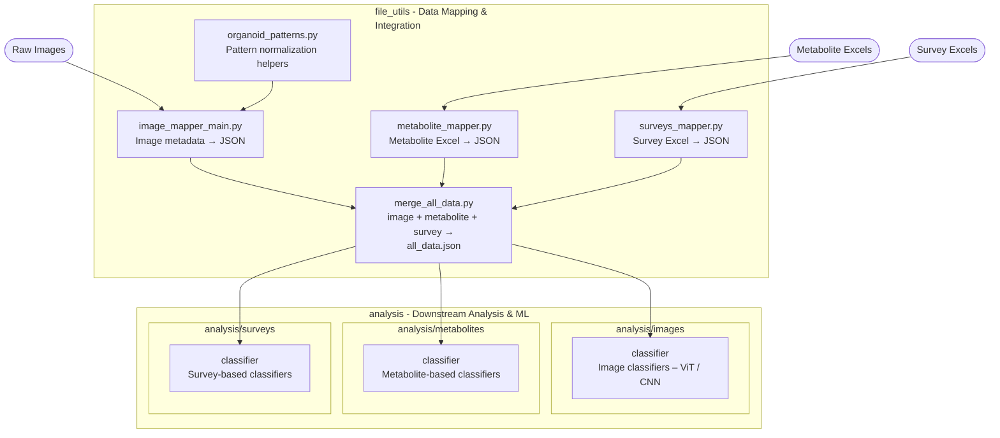

# Promega Organoid Analysis System

This repository contains a comprehensive system for analyzing organoid quality using multimodal data including images, metabolites, and survey assessments for time series prediction.

## Recent Changes (November 2025)

### Data Reorganization
The data pipeline has been reorganized to use a normalized records structure:

- **Normalized Records System**: Introduced `file_utils/merge/normalized_records.py` with `OrganoidRecord`, `OrganoidRecordBuilder`, and `RecordMetrics` to canonicalize organoid data
- **Unified Data Structure**: `all_data.json` now uses a `records` map with standardized organoid IDs plus a `summary.json` file containing metadata (totals, vote counts, metabolite outliers, skipped items)
- **View-Specific Outputs**: The merge process generates a main data file from which specialized views can be created by the image and survey classifiers:
  - `all_data.json` - Complete unified dataset with all organoid records
  - `image_classifier.json` - Day-indexed records optimized for image classifier training
  - `survey_classifier.json` - Day-indexed records optimized for survey classifier training
- **Enhanced Logging**: Rich-based structured logging throughout the merge process
- **Metadata Tracking**: Each view includes metadata about skipped records, vote counts, and data quality metrics

### Classifier Updates
- **Image Classifier** and **Survey Classifier**: Updated to read from new normalized JSON structure (`records` map instead of flat files)
- **Deterministic Training**: Added support for reproducible training runs with deterministic operations and seed control

## Project Structure



## Setup and Installation

### Development Setup (Full Installation)

For local development with full code access:

1. **Clone the repository**:
   ```bash
   git clone <repository-url>
   cd 2025-promega-mini-test
   ```

2. **Set up Python environment**:
   ```bash
   # On cluster, use the shared conda environment:
   # /net/projects2/promega

   # For local development, create a conda environment:
   micromamba create -n promega -f core_env.yaml
   ```

### Runtime Setup (Cluster Only)

For running existing code on the cluster without development:

1. **Access the cluster** and navigate to your project directory
2. **Use the shared conda environment**: `/net/projects2/promega`
3. **Update SLURM script paths** (see Quick Start section)
4. **No additional installation needed** - all dependencies are in the shared environment

## Quick Start

### 1. Environment Setup

**On Cluster**:
```bash
# The conda environment is located at:
/net/projects2/promega

# You don't need to activate it manually - the SLURM scripts will use it
```

**Local Development**:
```bash
# Activate your local conda environment
micromamba activate promega  # or your environment name
```

### 2. Run Data Processing Pipeline

The data processing pipeline consists of several sequential steps. **Follow these steps in order** to generate the master data files needed for analysis.

See the [**Data Processing Pipeline**](#data-processing-pipeline) section below for detailed step-by-step instructions.

**Quick Overview**:
1. Retrieve main identifiers from verification CSV
2. Map metabolite data from Excel files
3. Map survey data from Excel files
4. Map image files and metadata
5. *Placeholder for additional pre-processing steps*
6. Generate unified `all_data.json` file
7. Run image classifier training
8. Run survey classifier training

### ⚠️ IMPORTANT: Update Paths Before Running Analysis

**Before submitting any jobs**, you must update the hardcoded paths in the SLURM scripts to match your setup:

Replace:
- `/home/YOUR_GITHUB_NAME/YOUR_MINITEST_DIRECTORY` with the path to the GitHub repo directory on your machine
- `/path/to/data`  with the path to the pre-processed images (Image classifier) or survey directory (Survey classifier)
- `/path/to/all_data.json` with the path to the main data JSON file (Image classifier only)

Locations:
1. **`analysis/images/classifier/run_accuracy.s`**
   - Line 13: `PROJ_ROOT=/home/YOUR_GITHUB_NAME/YOUR_MINITEST_DIRECTORY`
   - Line 15: `DATA_DIR=/path/to/data/images`
   - Line 16: `ALL_DATA_JSON=/path/to/all_data.json`

2. **`analysis/surveys/classifier/run_survey_classifier.s`**
   - Line 13: `PROJ_ROOT=/home/YOUR_GITHUB_NAME/YOUR_MINITEST_DIRECTORY`
   - Line 15: `DATA_DIR=/path/to/data/surveys`

Example:
```bash
# If your username is jsmith and you cloned to /home/jsmith/promega-analysis
# Change: PROJ_ROOT=/home/YOUR_GITHUB_NAME/YOUR_MINITEST_DIRECTORY
# To:     PROJ_ROOT=/home/jsmith/promega-analysis
```

### 3. Run Analysis

#### Cluster (GPU Required)

**Important**: Analysis must be run on computation nodes (not login nodes) using SLURM job submission.

##### 3a. Image Classifier
```bash
# Navigate to classifier directory
cd /home/YOUR_GITHUB_NAME/MINITEST_DIRECTORY/analysis/images/classifier

# Submit the training job to SLURM
sbatch run_accuracy.s

# Monitor job status
squeue -u $USER

# Check logs
tail -f logs/soft-label_<JOBID>.out
```

The image classifier will train models for each day (Dy3, Dy6, Dy8, etc.) sequentially.
Results are saved in `DATA_DIR` which is defined in `run_accuracy.s`

##### 3b. Survey Classifier
```bash
# Navigate to survey classifier directory
cd /home/YOUR_GITHUB_NAME/MINITEST_DIRECTORY/analysis/surveys/classifier

# Submit the survey classifier job
sbatch run_survey_classifier.s

# Check completion
squeue -u $USER
cat logs/survey_<JOBID>.out
```

The survey classifier trains a ResNet50V2+CNN dual-input model on Day 30 organoids using survey evaluation labels.
Results include trained model (`.h5`), training curves, and confusion matrix. Results are saved in `DATA_DIR` which is defined in `run_survey_classifier.s`

#### Local Development

For local testing and development:

```bash
# Image Classifier
cd analysis/images/classifier
python train_model_accuracy.py \
    --out-dir ./outputs \
    --batch-size 8 \
    --epoch1 10 \
    --epoch2 20 \
    --test-frac 0.1 \
    --val-frac 0.1 \
    --target-width 512 \
    --target-height 384 \
    --seed 1 \
    --deterministic

# Survey Classifier
cd analysis/surveys/classifier
python simple_classifier.py \
    --out-dir ./outputs \
    --batch-size 8 \
    --epoch1 10 \
    --epoch2 20 \
    --target-day Dy30 \
    --target-width 224 \
    --target-height 224 \
    --seed 1 \
    --deterministic
```

**Note**: Local development requires GPU access for training. For CPU-only testing, use very small batch sizes and epochs, or test with a subset of data.

## Command Line Arguments

### Data Merge (`file_utils/merge/merge_all_data.py`)

**Entry Point**: `python file_utils/merge/merge_all_data.py`

**Required Arguments**:
- `--in-dir`: Path to input directory containing organoid data
- `--out-dir`: Path to output directory where JSON files will be saved

**Optional Arguments**:
- `--min-survey-votes`: Minimum votes for survey label (default: 4)
- `--survey-day`: Day that survey was conducted (default: 30)
- `--target-width`: Target image width in pixels (default: 512)
- `--target-height`: Target image height in pixels (default: 384)
- `--validate-schema`: Validate schema of generated `all_data.json` file (default: False)

**Example**:
```bash
python file_utils/merge/merge_all_data.py \
    --in-dir /path/to/input \
    --out-dir /path/to/output \
    --min-survey-votes 4 \
    --target-width 512 \
    --target-height 384 \
    --validate-schema
```

### Image Classifier (`analysis/images/classifier/train_model_accuracy.py`)

**Entry Point**: `python train_model_accuracy.py`

**Required Arguments**:
- `--out-dir`: Path to output directory where results will be saved

**Optional Arguments**:
- `--epoch1`: Number of training epochs for phase 1 (frozen backbone) (default: 100)
- `--epoch2`: Number of training epochs for phase 2 (unfrozen backbone) (default: 300)
- `--batch-size`: Training batch size (default: 16)
- `--val-batch-size`: Validation/Test batch size (defaults to batch-size)
- `--test-frac`: Fraction of data used for testing (default: 0.1)
- `--val-frac`: Fraction of data used for validation (default: 0.1)
- `--use-mask`: Include mask tensors and a mask branch in the classifier (default: False)
- `--input-path-key`: JSON field to use as image input ('img_path' or 'overlay_path') (default: 'img_path')
- `--target-width`: Target input image width in pixels (default: 512)
- `--target-height`: Target input image height in pixels (default: 384)
- `--num-workers`: Number of subprocesses for data loading (default: 0)
- `--seed`: Random seed for reproducibility (default: 1)
- `--deterministic`: Use deterministic operations for reproducibility (default: False)

**Example**:
```bash
python train_model_accuracy.py \
    --out-dir ./outputs \
    --batch-size 16 \
    --epoch1 50 \
    --epoch2 150 \
    --test-frac 0.1 \
    --val-frac 0.1 \
    --target-width 512 \
    --target-height 384 \
    --seed 1 \
    --deterministic
```

### Survey Classifier (`analysis/surveys/classifier/simple_classifier.py`)

**Entry Point**: `python simple_classifier.py`

**Required Arguments**:
- `--out-dir`: Path to output directory where results will be saved

**Optional Arguments**:
- `--batch-size`: Training batch size (default: 8)
- `--epoch1`: Number of training epochs for phase 1 (frozen backbone) (default: 50)
- `--epoch2`: Number of training epochs for phase 2 (unfrozen backbone) (default: 150)
- `--target-day`: Target day for training (default: "Dy30")
- `--target-width`: Target input image width in pixels (default: 224)
- `--target-height`: Target input image height in pixels (default: 224)
- `--deterministic`: Use deterministic operations (default: False)
- `--seed`: Random seed for reproducibility (default: 1)

**Example**:
```bash
python simple_classifier.py \
    --out-dir ./outputs \
    --batch-size 8 \
    --epoch1 50 \
    --epoch2 150 \
    --target-day Dy30 \
    --target-width 224 \
    --target-height 224 \
    --seed 1 \
    --deterministic
```

### Schema Validation (`file_utils/merge/validate_schema.py`)

**Entry Point**: `python file_utils/merge/validate_schema.py`

**Required Arguments**:
- `json_file`: Path to `all_data.json` file to validate

**Optional Arguments**:
- `--sample`: Number of records to sample for validation (default: validate all records)
- `--strict`: Treat warnings as errors (default: False)
- `--quiet`: Suppress validation report output, only show errors (default: False)
- `--log-level`: Set logging level - DEBUG, INFO, WARNING, ERROR (default: INFO)

**Example**:
```bash
# Validate entire file
python file_utils/merge/validate_schema.py data/output/json/all_data.json

# Validate sample of 100 records
python file_utils/merge/validate_schema.py data/output/json/all_data.json --sample 100

# Strict mode (treat warnings as errors)
python file_utils/merge/validate_schema.py data/output/json/all_data.json --strict

# Quiet mode (only show errors)
python file_utils/merge/validate_schema.py data/output/json/all_data.json --quiet
```

### Retrieve Main Identifiers (`file_utils/images/retrieve_main_identifiers.py`)

**Entry Point**: `python file_utils/images/retrieve_main_identifiers.py`

**Description**: Extracts and normalizes main identifiers from image filename bases in a CSV file. The script processes filename bases by:
- Replacing split markers: `(1)%` → `split_1`, `(2)%` → `split_2`, `-2-%(stitched)` → `split_2`
- Removing stitched markers: `(stitched)` → removed
- Normalizing case: `Ba` → `BA`
- Stripping trailing `%` characters

**Required Arguments**:
- `--csv-file`: Path to CSV file containing a `filename base` column
- `--out-file`: Path to output JSON file where normalized identifiers will be saved

**Example**:
```bash
python file_utils/images/retrieve_main_identifiers.py \
    --csv-file input.csv \
    --out-file main_identifiers.json
```

**Input/Output Example**:
- Input filename base: `"Ba4 96_1 Dy28 C12(1)%"`
- Output identifier: `"BA4 96_1 Dy28 C12 split_1"`

## Input Data Types

The system processes three main types of input data:

### 1. Image Data
- **Raw Images**: Multi-Z-stack TIFF files (`.tif`) from microscopy
- **Processed Images**: Resized PNG files at multiple resolutions:
  - `256x192`: Lower resolution for quick processing
  - `512x384`: Standard resolution for training (default)
- **Masks**: Segmentation masks (predicted or manual) as PNG files
- **Overlays**: Image-mask overlay visualizations

**Location on Cluster**: `/net/projects2/promega/data-analysis/output/infer_resized_512x384/`

**Structure**:
```
images/
├── raw_images/          # Original TIFF files
├── infer_resized_512x384/  # Processed PNG files
└── ...
masks/
├── predicted/           # ML-generated masks
├── manual/              # Human-annotated masks
└── image_overlays/      # Visualization overlays
```

### 2. Metabolite Data
- **Format**: Excel spreadsheets (`.xlsx`)
- **Content**: Chemical assay measurements for 6 metabolites:
  - BCAAGlo, GlucoseGlo, GlutamateGlo, LactateGlo, MalateGlo, PyruvateGlo
- **Fields**: Concentration values, initial concentrations, outlier flags, well mappings

**Location on Cluster**: `/net/projects2/promega/data-analysis/metabolite_data/`

**Example File**: `metabolite_data_07_23_25.xlsx`

### 3. Survey Data
- **Format**: Excel spreadsheets (`.xlsx`)
- **Content**: Quality assessment evaluations from human raters
- **Structure**: Individual votes (5 per organoid) with "Acceptable" or "Not Acceptable" labels
- **Processing**: Majority voting (4+ votes) determines final label

**Location on Cluster**: `/net/projects2/promega/data-analysis/results_surveys/`

**Example File**: `organoid_surveys_aggregated.json` (generated from Excel)

### 4. Generated JSON Files

After running the merge process, the following JSON files are generated:

- **`all_data.json`**: Complete unified dataset with all organoid records
  - Structure: `{"schema_version": 1, "generated_at": "...", "stats": {...}, "records": {...}}`
  - Records keyed by organoid ID: `"BA1_96_1_Dy03_A1"`

- **`image_classifier.json`**: Day-indexed view for image classifier training
  - Structure: `{"metadata": {...}, "records": {"Dy3": {...}, "Dy6": {...}, ...}}`
  - Each day contains arrays: `img_path`, `mask_path`, `label`

- **`survey_classifier.json`**: Day-indexed view for survey classifier training
  - Structure: `{"metadata": {...}, "records": {"Dy30": {...}}}`
  - Contains arrays: `img_path`, `mask_path`, `label` (computed from survey evaluations)

## Resource Requirements

### Cluster Resources (SLURM)

**Image Classifier**:
- **GPU**: 1x A100 (required)
- **Memory**: 32GB RAM
- **Time**: ~2 hours per job
- **Storage**: ~10GB for model checkpoints and outputs per training run

**Survey Classifier**:
- **GPU**: 1x A100 (required)
- **Memory**: 32GB RAM
- **Time**: ~2 hours per job
- **Storage**: ~5GB for model checkpoints and outputs

**Data Merge**:
- **CPU**: Standard compute node (no GPU needed)
- **Memory**: 8GB RAM (sufficient for 5,168 records)
- **Time**: ~5-10 minutes
- **Storage**:
  - Input: ~50GB (raw images, processed images, masks)
  - Output: ~500MB (JSON files)

### Local Development

**Minimum Requirements**:
- **GPU**: NVIDIA GPU with CUDA support (recommended) or CPU-only for small-scale testing
- **Memory**: 16GB RAM minimum, 32GB recommended
- **Storage**:
  - Code: ~500MB
  - Data: Depends on subset size (see Test Data section)
  - Models: ~2-5GB per training run

**Recommended for Full Training**:
- **GPU**: NVIDIA GPU with 8GB+ VRAM (RTX 3070/3080, A100, etc.)
- **Memory**: 32GB+ RAM
- **Storage**: 100GB+ free space

## Test Data and Quick Development

### Test Data Availability

Currently, there is **no dedicated test dataset** for quick local development. However, you can:

1. **Use a subset of the full dataset**:
   ```python
   # In your training script, filter to a single day with fewer samples
   # Example: Use only Dy3 which typically has fewer organoids
   python train_model_accuracy.py --out-dir ./test_outputs --epoch1 5 --epoch2 10
   ```

2. **Reduce data size for testing**:
   - Train on a single day instead of all days
   - Use smaller batch sizes (4-8 instead of 16)
   - Reduce number of epochs (5-10 instead of 100-300)

3. **Create a minimal test set** (manual):
   - Copy 10-20 images and corresponding masks to a test directory
   - Create a minimal JSON file with just those records
   - Point your training script to this test data

### Agile Development Workflow

For iterative development:

1. **Start with minimal configuration**:
   ```bash
   # Quick test run with minimal epochs
   python train_model_accuracy.py \
       --out-dir ./test_outputs \
       --epoch1 2 \
       --epoch2 5 \
       --batch-size 4 \
       --test-frac 0.2 \
       --val-frac 0.2
   ```

2. **Use deterministic mode** for reproducible debugging:
   ```bash
   --deterministic --seed 1
   ```

3. **Monitor with smaller validation sets** to speed up iteration

4. **Test code changes** before running full training on cluster

## Data Sharing on Cluster

### Data Locations

**Shared Data Directory**: `/net/projects2/promega/data-analysis/`

**Structure**:
```
/net/projects2/promega/data-analysis/
├── output/
│   ├── json/
│   │   ├── all_data.json
│   │   ├── image_classifier.json
│   │   └── survey_classifier.json
│   ├── infer_resized_512x384/  # Processed images
│   └── ...
├── metabolite_data/
│   └── metabolite_data_07_23_25.xlsx
├── results_surveys/
│   └── organoid_surveys_aggregated.json
└── ...
```

### Sharing Your Results

1. **Model outputs**: Save to your home directory or a shared results directory
2. **Generated JSON files**: Can be shared via the shared data directory
3. **Logs**: Keep in your project's `logs/` directory

### Accessing Shared Data

All cluster users have read access to `/net/projects2/promega/data-analysis/`

## Data Processing Pipeline

This section provides detailed step-by-step instructions for processing raw data into the unified dataset used for analysis.

### Prerequisites

Before starting, ensure you have:
- Python environment set up (see [Setup and Installation](#setup-and-installation))
- Required input data files:
  - Image verification CSV file
  - Metabolite Excel files
  - Survey Excel files
  - Raw image files (TIFF format)
  - Sample tracing Excel file (metadata)

### STEP 1: Retrieve Main Identifiers

Extract and normalize main identifiers from the image verification CSV file.

**Command**:
```bash
python3 -m file_utils.identifiers.retrieve_main_identifiers \
    --csv-file <path/to/image_verification.csv> \
    --out-file <path/to/main_identifiers.json>
```

**What it does**:
- Processes filename bases from the CSV file
- Normalizes identifiers (e.g., `Ba4` → `BA4`, handles split markers)
- Outputs normalized identifiers to JSON file

**Output**: `main_identifiers.json` - Normalized identifier list used by subsequent mappers

**Important Assumptions**:
- Batch 1 Day 20 and Day 21 from other batches are normalized to Day 20.5

### STEP 2: Map Metabolite Data

Process metabolite Excel files and map them to main identifiers.

**Command**:
```bash
python -m file_utils.metabolites.metabolite_mapper \
    --in-file <path/to/metabolite_data.xlsx> \
    --identifiers <path/to/main_identifiers.json> \
    --out-file <path/to/metabolite_map.json>
```

**What it does**:
- Reads metabolite concentration data from Excel file
- Maps metabolite data to normalized identifiers
- Handles day normalization (Day 20/21 → Day 20.5)
- Duplicates metabolite data across splits with the same main identifier

**Output**: `metabolite_map.json` - Metabolite data mapped to identifiers

**Important Assumptions**:
- Batch 1 Day 20 and Day 21 from other batches are treated as Day 20.5
- Metabolite data can be duplicated across splits with the same main identifier
- Split information in main identifiers may not match metabolite spreadsheet identifiers

### STEP 3: Map Survey Data

Process survey Excel files and map evaluations to identifiers.

**Command**:
```bash
python -m file_utils.surveys.surveys_mapper \
    --in-dir <path/to/survey/excel/files> \
    --out-file <path/to/survey_map.json> \
    --identifiers <path/to/main_identifiers.json>
```

**What it does**:
- Processes survey Excel files from input directory
- Extracts evaluation data (employee, evaluation, quality scores)
- Maps survey data to normalized identifiers
- Handles cases where multiple organoids are assigned to one identifier
- Computes labels: Uses majority voting (4+ votes) to determine labels

**Output**: `survey_map.json` - Survey evaluation data mapped to identifiers

**Note**: The survey map includes an `organoid_id` key layer to handle cases with multiple organoids per identifier.

### STEP 4: Map image data

Map raw image files to metadata and create image mapping JSON.

**Command**:
```bash
python3 -m file_utils.images.image_mapper \
    --base-dir <path/to/raw_images> \
    --verify-csv <path/to/image_verification.csv> \
    --meta-xlsx <path/to/Sample-Tracing.xlsx> \
    --identifiers <path/to/main_identifiers.json> \
    --out-file <path/to/image_map.json>
```

**What it does**:
1. **Loads metadata**: Creates DataFrame from Sample-Tracing Excel, adds pixel scale (`um_per_px`), extracts batch/plate/day/well
2. **Groups data**: Groups metadata by day, batch plate, and well
3. **Computes pre-split wells**: Tracks split organoids and aggregates pre-split observations
4. **Processes each group**:
   - Gets identifier and compares to main identifiers
   - Resolves images:
     - Finds candidate raw image files matching identifier
     - Sorts by Z-level
     - Handles split indexes and stitched images
     - Selects best focus image
   - Creates entries with classification (SplitStitched, SplitPartial, Split, Duplicate, Regular)
   - Adds verification metadata (split, stitched, blank flags)
5. **Saves mapping**: Writes complete image mapping to JSON file

**Output**: `image_map.json` - Complete image file mapping with metadata

### STEP 5: *Placeholder for other pre-processing steps*

Placeholder for other pre-processing steps

### STEP 6: Generate All Data JSON File

Merge all mapped data sources into unified `all_data.json` file.

**Command**:
```bash
python3 -m file_utils.merge.merge_all_data \
    --data-dir <path/to/data/directory>
```

**Alternative (with explicit input/output)**:
```bash
python3 -m file_utils.merge.merge_all_data \
    --in-dir <path/to/input> \
    --out-dir <path/to/output>
```

**What it does**:
1. **Builds survey map**: Normalizes keys and aggregates survey evaluations
2. **Builds manual mask map**: Normalizes keys and updates paths
3. **Loads processed images**: Aggregates `image_mapping*_processed.json` files
   - Normalizes day identifiers (Dy20/Dy21 → Dy20.5) in keys
   - Updates hardcoded paths to actual file locations
4. **Loads preprocessed images**: Aggregates preprocessed JSON files
   - Normalizes day identifiers in metadata keys
5. **Merges data sources**: For each identifier:
   - Combines base image info, processed images, preprocessed images
   - Adds survey data, metabolite data, manual masks
   - Determines labels (survey label takes priority, then preprocessed label)
   - Extracts numerical day (handles Day 20/21 → 20.5 normalization)
6. **Builds normalized records**: Creates canonical organoid records with standardized structure
7. **Validates schema**: Ensures data integrity (if `--validate-schema` flag used)
8. **Generates view-specific outputs**:
   - `all_data.json` - Complete unified dataset
   - `image_classifier.json` - Day-indexed view for image training
   - `survey_classifier.json` - Day-indexed view for survey training

**Output Files**:
- `all_data.json` - Complete dataset with all organoid records
- `summary.json` - Statistics and metadata

**Important Assumptions**:
- Survey label takes priority when populating the `label` field
- Image label is taken from preprocessed JSON data if survey label unavailable
- Day 20 and Day 21 are normalized to Day 20.5

### STEP 7: Image Classifier Training

Train image classification models for each day.

**On Cluster (SLURM)**:
```bash
cd analysis/images/classifier
sbatch run_accuracy.s
```

**Local Development**:
```bash
python3 -m analysis.images.classifier.train_model_accuracy \
    --epoch1 <num_epochs_phase1> \
    --epoch2 <num_epochs_phase2> \
    --val-frac <validation_fraction> \
    --test-frac <test_fraction> \
    --deterministic \
    --data-dir <path/to/data>
```

**What it does**:
1. **Loads data**: Reads `all_data.json`
2. **Preprocesses**: Extracts image paths, mask paths, and labels; saves to `image_classifier.json`
3. **Splits data**: Creates train/validation/test sets
4. **Trains models**: For each model backbone (ViT, ResNet, CNN):
   - **Phase 1**: Freezes backbone, trains classifier head (default: 100 epochs)
   - **Phase 2**: Unfreezes backbone, fine-tunes entire model (default: 300 epochs)
   - Uses early stopping to prevent overfitting
   - Calculates class weights for imbalanced data
5. **Evaluates**: Computes accuracy, F1 score, and AUC-ROC on validation and test sets
6. **Saves results**: Model checkpoints, training curves, metrics, and summaries

**Output**: Trained models, metrics, and plots saved to output directory

### STEP 8: Survey Classifier Training

Train survey-based classification model on Day 30 organoids.

**On Cluster (SLURM)**:
```bash
cd analysis/surveys/classifier
sbatch run_survey_classifier.s
```

**Local Development**:
```bash
python3 -m analysis.surveys.classifier.simple_classifier \
    --epoch1 <num_epochs_phase1> \
    --epoch2 <num_epochs_phase2> \
    --deterministic \
    --data-dir <path/to/data>
```

**What it does**:
1. **Loads data**: Reads from `all_data.json`
2. **Filters**: Keeps only Day 30 records with survey evaluations
3. **Preprocesses**: Extracts image paths, mask paths, and labels; saves to `survey_classifier.json`
4. **Creates datasets**: TensorFlow datasets with augmentation for training
5. **Builds model**: Dual-input ResNet50V2 + CNN model:
   - Image input: Pretrained ResNet50V2 backbone
   - Mask input: Custom CNN for mask features
   - Combined classification head
6. **Trains model**:
   - **Phase 1**: Frozen ResNet50V2 backbone (default: 50 epochs)
   - **Phase 2**: Unfreezes last 10 layers, fine-tunes (default: 150 epochs)
7. **Evaluates**: Computes accuracy, confusion matrix, and training curves
8. **Saves**: Model weights, training history, and visualizations

**Output**: Trained model (`.h5`), training curves, confusion matrix, metrics

---

## Pipeline Overview

The complete pipeline flow:

1. **Individual Mappers**: Process raw data sources
   - `file_utils/images/image_mapper.py` - Maps image files to metadata
   - `file_utils/metabolites/metabolite_mapper.py` - Processes metabolite Excel data
   - `file_utils/surveys/surveys_mapper.py` - Processes survey Excel data

2. **Master Merger**: Combines all data sources
   - `file_utils/merge/merge_all_data.py` - Creates unified `all_data.json` and view-specific JSON files

3. **Analysis**: Uses normalized JSON files as single source of truth
   - All analysis code in `analysis/` directory
   - No direct access to raw data files
   - Standardized organoid key format: `"BA1 96_1 Dy03 A1"`

## Data Structure

The `all_data.json` file contains unified organoid data with structure:
```json
{
  "schema_version": 1,
  "generated_at": "2025-11-24T16:34:36.725704+00:00",
  "stats": {
    "total_records": 5168,
    "survey_matches": 393,
    "num_acceptable_votes": 1356,
    "num_not_acceptable_votes": 749,
    ...
  },
  "records": {
    "BA1_96_1_Dy03_A1": {
      "id": "BA1 96_1 Dy03 A1",
      "day": {
        "id": "Dy3",
        "number": 3.0,
        "original": "Dy03"
      },
      "cell_line": "GM23279A",
      "images": {
        "processed": {
          "img_path": "/path/to/image.png",
          "mask_path": "/path/to/mask.png",
          "overlay_path": "/path/to/overlay.png"
        }
      },
      "metabolites": {
        "GlucoseGlo": {
          "concentration_uM": 9.827,
          "is_outlier": false
        },
        ...
      },
      "survey": {
        "evaluations": [...],
        "label": {
          "value": "Acceptable",
          "acceptance_flag": 1
        }
      }
    }
  }
}
```

The view-specific files (`image_classifier.json`, `survey_classifier.json`) use a day-indexed structure:
```json
{
  "metadata": {
    "total_skipped": 2041,
    ...
  },
  "records": {
    "Dy3": {
      "img_path": ["/path/to/img1.png", ...],
      "mask_path": ["/path/to/mask1.png", ...],
      "label": [1, 0, 1, ...]
    },
    "Dy6": {...},
    ...
  }
}
```

## Development Guidelines

- **Environment**: Always activate conda environment first: `conda activate /net/projects2/promega` (cluster) or your local environment
- **Data Access**: Use normalized JSON files (`all_data.json`, `image_classifier.json`, `survey_classifier.json`) as single source of truth
- **Execution**: Run everything from project root directory
- **Reproducibility**: Use `--deterministic` and `--seed` flags for reproducible experiments

## Current Status

✅ **Fully Functional System** (Updated November 2025)
- Data reorganization completed with normalized records structure
- All immediate code quality fixes completed
- Working data generation pipeline producing complete 5,168-record dataset
- Multimodal data integration (images, metabolites, surveys) operational
- Centralized configuration and pattern management implemented
- Comprehensive error handling and validation added
- View-specific JSON outputs for optimized classifier training
- Deterministic training support for reproducible experiments

## Known Issues & Future Improvements

See `CLAUDE.md` for detailed code analysis and recommended architectural enhancements.


