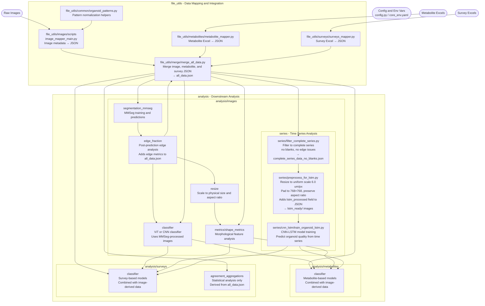

# Promega Organoid Analysis System

This repository contains a comprehensive system for analyzing organoid quality using multimodal data including images, metabolites, and survey assessments for time series prediction.

## Project Structure



## Quick Start

### 1. Environment Setup
```bash
# Activate the required conda environment
conda activate /net/projects2/promega

# Ensure your .env file is configured with required paths
```

### 2. Generate Master Data File
```bash
# From the root directory, generate all_data.json
python file_utils/merge/merge_all_data.py
```

### 3. Run Analysis
```bash
# All analysis runs from root directory
python analysis/images/classifier/train_model_accuracy.py
python analysis/surveys/classifier/simple_classifier.py
```

## Configuration System

The system uses a centralized `config.py` file that loads configuration from environment variables. Key variables:

- `BASE_PATH` - Root directory for raw data
- `OUTPUT_FOLDER` - Location for processed outputs  
- `SURVEY_RESULTS` - Directory containing Excel survey files
- `METABOLITE_DATA_DIR` - Directory for metabolite Excel files
- `TARGET_WIDTH` / `TARGET_HEIGHT` - Image processing dimensions

Create a `.env` file in the project root with these variables set to your local paths.

## Data Processing Pipeline

1. **Individual Mappers**: Process raw data sources
   - `file_utils/images/image_mapper_main.py` - Maps image files to metadata
   - `file_utils/metabolites/metabolite_mapper.py` - Processes metabolite Excel data
   - `file_utils/surveys/surveys_mapper.py` - Processes survey Excel data

2. **Master Merger**: Combines all data sources
   - `file_utils/merge/merge_all_data.py` - Creates unified `all_data.json`

3. **Analysis**: Uses `all_data.json` as single source of truth
   - All analysis code in `analysis/` directory
   - No direct access to raw data files
   - Standardized organoid key format: `"BA1 96_1 Dy30 A1"`

## Data Structure

The `all_data.json` file contains unified organoid data with structure:
```json
{
  "BA1 96_1 Dy03 A1": {
    "dayID": "Dy03",
    "BA": "BA1 96_1", 
    "wellID": "A1",
    "day_num": 3,
    "mdl_day": 3.0,
    "Best Z Filename": "/path/to/image.tif",
    "256x192": { "img_path": "...", "mask_path": "..." },
    "512x384": { "img_path": "...", "mask_path": "..." },
    "metabolites": { "GlucoseGlo": {...}, "ATP": {...} },
    "survey": { "evaluations": [...], "quality_scores": [...] }
  }
}
```

## Key Features

- **Multimodal Data Integration**: Images, metabolites, and surveys in one structure
- **Time Series Analysis**: Organoid quality tracking across days (Dy3, Dy6, Dy8, etc.)
- **Standardized Processing**: Consistent image resolutions and metadata
- **Environment-Based Configuration**: No hardcoded paths
- **Comprehensive Analysis Tools**: Classification, segmentation, and statistical analysis

## Development Guidelines

- **Environment**: Always activate conda environment first: `conda activate /net/projects2/promega`
- **Configuration**: Use `config.py` for all path and setting management
- **Data Access**: Use `all_data.json` as single source of truth
- **Analysis Location**: Place all analysis code in `analysis/` directory
- **Execution**: Run everything from project root directory

## Current Status

✅ **Fully Functional System** (Updated August 2025)
- All immediate code quality fixes completed
- Working data generation pipeline producing complete 4,276-record dataset (9.5MB)
- Multimodal data integration (images, metabolites, surveys) operational
- Centralized configuration and pattern management implemented
- Comprehensive error handling and validation added

## Known Issues & Future Improvements

See `CLAUDE.md` for detailed code analysis and recommended architectural enhancements.


