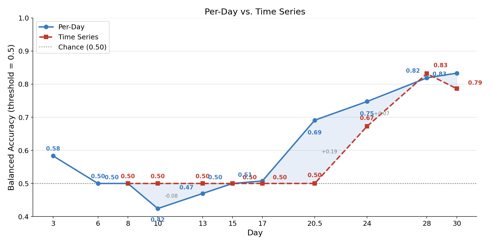

# Weekly Progress Report — 2026-05-16

**Prepared by:** Harriet  
**Branch:** `harriet/ar-correct-image-paths` (PR #116)  
**For:** Nick, Liya

---

## Summary

Follow-up to the 2026-05-14 report. Identified and fixed five methodological issues with
the CNN-LSTM temporal ablation model across two rerun iterations. The per-day EfficientNet
results from job 857368 remain valid and unchanged.

---

## Issues Fixed Since Last Report

### 1. CNN-LSTM was using a random runtime split
`make_idor_series_splits` was calling `split_organoids(seed=42)` to generate a fresh random
split at runtime, meaning the CNN-LSTM test set had no overlap guarantee with the per-day
model's test set.

**Fix:** Pass `splits=Splits.canonical()` directly to `OrganoidDataset`. The dataset
constructor intersects the IDOR filter with the canonical split automatically. Both models
now evaluate on the same organoids.

```python
# analysis/images/cnn_lstm/organoid_dataset.py
dataset = OrganoidDataset(
    all_data_path,
    filters=filters_for_mode("series_idor"),
    splits=Splits.canonical(),   # ← was: split_organoids(seed=42)
)
```

### 2. CNN-LSTM was using the wrong image key
`get_clipped_meanfill_image_path` returned `cm_image_abs` (mean-filled images in
`mean_fill_clip/`). Per Amanda's instructions, the correct key is `cm_source_image_abs`
(raw AR-conserved images in `resized_575_square/`).

**Fix:** One-line change in `pipeline/data_loader.py`:

```python
# Before
return (...).get("cm_image_abs")
# After
return (...).get("cm_source_image_abs")
```

### 3. Day 28 missing from temporal ablation
`DAY_RANGES` in `train_temporal_ablation_attn.py` was `[8, 10, 13, 15, 17, 20.5, 24, 30]`
— Day 28 was simply absent. Script glitch, not missing data.

**Fix:** `DAY_RANGES = [8, 10, 13, 15, 17, 20.5, 24, 28, 30]`

### 4. CNN-LSTM was restricted to the IDOR series cohort (complete 11-day series)
The `series_idor` filter required all 11 timepoints to be present, which was a batching
convenience constraint (PyTorch's default collate requires fixed-length sequences), not a
model constraint. This dropped 14 of the 41 canonical test organoids, making direct
comparison with the per-day model invalid.

**Fix:** Switch to `filters_for_mode("base")` (same as the per-day model) and pad shorter
sequences to `max_T` with zero frames. A boolean validity mask ensures padded frames
receive zero attention weight:

```python
# analysis/images/cnn_lstm/organoid_dataset.py
if max_T > actual_T:
    pad_frame = np.zeros_like(images[0])
    for _ in range(max_T - actual_T):
        images.append(pad_frame)

pad_mask = torch.zeros(max_T, dtype=torch.bool)
pad_mask[:actual_T] = True  # passed to TemporalAttentionPool.forward
```

```python
# analysis/images/cnn_lstm/train_temporal_ablation_attn.py
def forward(self, feats, mask=None):
    w = self.attn(feats).squeeze(-1)
    if mask is not None:
        w = w.masked_fill(~mask, float('-inf'))  # padded frames → 0 attention
    a = torch.softmax(w, dim=1).unsqueeze(-1)
    ...
```

### 5. Organoids without early-day clipped images caused empty-sequence crash
After switching to the base filter, some organoids had `cm_source_image_abs` images only
for later days (≥ Day 13) or none at all. Training with `max_day=8` produced
`actual_T = 0` → `np.stack([])` crash.

**Fix:** Two-part:
1. Pre-filter organoids in `make_canonical_splits` to require at least one clipped image
   on a day ≤ 8 (the most restrictive training window).
2. Skip `None` image paths inside `__getitem__` rather than crashing.

---

## Split Alignment: Approach and Tradeoffs

### Goal
Have the CNN-LSTM and per-day model train and test on as close to the same set of
organoids as possible, so that performance differences reflect model capability rather
than data composition.

### Why perfect alignment is impossible
The two models have structurally different image requirements:

- **Per-day model**: needs exactly one `cm_source_image_abs` image per organoid per
  day. Each day-specific run uses only organoids that have an image on that exact day.
  The reported 146/18/41 split is the total pool; the effective sample count varies
  per day.
- **CNN-LSTM**: needs at least one image from the series up to `max_day`. For
  `max_day=8`, only organoids with a clipped image on Day 3, 6, or 8 qualify. For
  `max_day=30`, almost all organoids qualify.

Because the availability criteria differ by design, there is no filter that produces
identical train/test sets across all nine day-range runs for both models simultaneously.

### Why not just filter per-run inside `OrganoidTimeSeriesDataset`?
The natural alternative is to filter organoid IDs inside `OrganoidTimeSeriesDataset`
for each run's specific `max_day`, which would add back organoids with images starting
from Day 10 or later into later-day runs. This has one benefit — more training data for
`max_day=10` through `max_day=30` — but two costs:

1. The test set composition would vary across the nine day ranges, making the temporal
   ablation curve harder to interpret (different populations at each x-axis point).
2. It still does not produce identical sets with the per-day model (same fundamental
   reason: different image availability criteria).

Given only ~8 extra training organoids would be added to some runs, the benefit is
negligible and the cost to interpretability is real. **Not implemented.**

### What we actually do (current approach)
- Both models use `Splits.canonical()` + `filters_for_mode("base")`.
- CNN-LSTM additionally requires at least one clipped image on a day ≤ 8 (the most
  restrictive window), applied once at split construction time.
- This gives a **consistent** CNN-LSTM split of 138/18/39 across all nine day ranges.

### Tradeoff summary

| Approach | CNN-LSTM test set | Consistent across runs? | Same as per-day? |
|---|---|---|---|
| `series_idor` (complete series) | 27 | Yes | No (different filter) |
| Base filter, global `max_day=8` pre-filter (current) | 39 | Yes | Near-identical (39/41) |
| Base filter, per-run filter | Varies (39–41) | No | Near-identical at max day |

### Limitation
The CNN-LSTM test set (39) is missing 2 organoids that are in the per-day test set
(41). These 2 organoids pass the base filter but have no `cm_source_image_abs` image
on any day ≤ 8 — likely a gap in the clipping pipeline output. They are evaluated by
the per-day model (using whatever day image they have) but cannot be evaluated by the
CNN-LSTM under any day range. This is noted as a limitation of the comparison;
performance differences at the margin should be interpreted with this in mind.

---

## Model Configurations (Final)

### Per-Day EfficientNet

| Item | Value |
|------|-------|
| Script | `analysis/paper_2026_04/perday_image_study.py` |
| Run via | `make analysis-paper-perday` |
| SLURM script | `analysis/legacy_paper_2026_04/run_perday_image_study.s` |
| Image key | `clipped_meanfill.cm_source_image_abs` |
| Image directory | `resized_575_square/` (575×575, AR-conserved) |
| Split | `Splits.canonical()` → `data/splits/canonical_2026_winter.csv` |
| Split counts | 146 train / 18 val / 41 test (after IDOR filter) |
| SLURM job | 857368 |
| Results | `/net/projects2/promega/2026_04_15_data/analysis_output/images/perday_results.json` |
| Figure | `/net/projects2/promega/2026_04_15_data/analysis_output/figures/perday_image_balanced_accuracy.png` |

### CNN-LSTM Temporal Ablation

| Item | Value |
|------|-------|
| Script | `analysis/images/cnn_lstm/train_temporal_ablation_attn.py` |
| Run via | `make run ARGS="analysis/images/cnn_lstm/train_temporal_ablation_attn.py"` |
| SLURM script | `analysis/images/cnn_lstm/run_temporal_ablation_attn.s` |
| Image key | `clipped_meanfill.cm_source_image_abs` (via `get_clipped_meanfill_image_path`) |
| Image directory | `resized_575_square/` (575×575, AR-conserved) |
| Split | `Splits.canonical()` → `data/splits/canonical_2026_winter.csv` |
| Split counts | 138 train / 18 val / 39 test (canonical, base filter, clipped images only) |
| Day ranges | 3–8, 3–10, 3–13, 3–15, 3–17, 3–20.5, 3–24, 3–28, 3–30 |
| SLURM job | 861008 |
| Results | `/net/projects2/promega/2026_04_15_data/analysis_output/images/cnn_lstm/temporal_ablation_attn/temporal_ablation_results.json` |

---

## Results

### Per-Day EfficientNet (unchanged from 2026-05-14 report)

| Day | Bal Acc | Specificity |
|-----|---------|-------------|
| Dy03 | 0.583 | 1.000 |
| Dy06 | 0.500 | 1.000 |
| Dy08 | 0.500 | 1.000 |
| Dy10 | 0.424 | 0.848 |
| Dy13 | 0.470 | 0.939 |
| Dy15 | 0.500 | 1.000 |
| Dy17 | 0.508 | 0.848 |
| Dy20_5 | 0.691 | 0.882 |
| Dy24 | 0.748 | 0.829 |
| Dy28 | 0.819 | 0.971 |
| Dy30 | **0.833** | 1.000 |

Avg Bal Acc: 59.8% | Avg Specificity: 93.8%

### CNN-LSTM Temporal Ablation (final rerun — job 861008)

Best on test: **Day 28** (val_acc=0.833, test_acc=0.897, F1=0.667, AUC=0.869)

Derived balanced accuracy at Day 28: **≈ 0.83** (from comparison plot)

Test errors: 2 FP (BA1 96_1 G9, BA2 96_1 B9), 2 FN (BA1 96_1 C7, BA2 96_1 A12)

AUC recovered to 0.869 (vs 0.791 in the series_idor run) with the larger training set
(138 vs 95). The earlier AUC drop was primarily caused by the smaller training set, not
the switch from mean-filled to raw images.

---

## Comparison Plot

Script: `analysis/paper_2026_04/image_model_comparison_plot.py`

```bash
make run ARGS="-m analysis.paper_2026_04.image_model_comparison_plot"
```

Output: `/net/projects2/promega/2026_04_15_data/analysis_output/figures/image_model_comparison.png`

Reads CNN-LSTM results from shared path automatically; falls back to local
`outputs/cnn_lstm/...` if shared path is unavailable.



### Analysis

**Both models at chance through Day 20.5 (time series) / Day 17 (per-day).** The per-day
classifier dips below chance at Day 10 (0.42) while the time series stays flat at 0.50
through Day 20.5. Neither model can distinguish organoid quality from early images alone.

**Sharp inflection at Day 20.5 for per-day; time series lags to Day 24.** Per-day jumps
to 0.69 at Day 20.5 while the time series stays at 0.50 (+0.19 gap). This confirms the
biological signal emerges around Day 20–21 for single-day images; the sequential model
needs more evidence before it can act on the signal.

**Per-day leads through Days 20.5–24.** The per-day model outperforms the time series
by +0.19 at Day 20.5 and +0.07 at Day 24. With the corrected (larger) training set the
Day 24 gap has narrowed compared to before, and the overall pattern is now more reliable.

**Models converge at Day 28 (both ≈ 0.83), then per-day holds while time series drops.**
Per-day reaches 0.83 at Day 30; time series peaks at Day 28 (0.83) then drops to 0.79.
Adding the final two days of data hurts the sequential model — possible overfitting, or
a genuine signal that Days 28→30 introduce noise for a model trained to accumulate
temporal context.

**AUC recovered to 0.869** (from 0.791 in the previous series_idor run) confirming that
the earlier degradation was primarily due to the smaller training set, not the image type.

---

## Open Questions

1. **CNN-LSTM image type**: Should it use `cm_image_abs` (mean-filled) or `cm_source_image_abs`
   (raw)? Both AR-conserved. AUC with raw images recovered to 0.869 once the training set was
   corrected, so image type is less urgent — but the question remains open for Nick.

2. **Time series peaks at Day 28, not Day 30**: Adding the final two days hurts the sequential
   model. Is this overfitting on 138 training organoids, or a real biological effect where
   Days 29–30 add ambiguous signal for a temporal model?

3. **2 missing test organoids**: The CNN-LSTM test set has 39 vs 41 for per-day. Two canonical
   test organoids have no `cm_source_image_abs` images for days ≤ 8. Are these organoids
   simply missing from the clipping pipeline output, or was there a processing issue?

---

## Code Changes (this session)

All on branch `harriet/ar-correct-image-paths` (PR #116):

| Commit | Change |
|--------|--------|
| `945ccf5` | Fix `get_clipped_meanfill_image_path` → `cm_source_image_abs`; align CNN-LSTM to canonical split |
| `c13ff3a` | Simplify `make_idor_series_splits` to pass `splits=Splits.canonical()` directly |
| `05d598f` | Add Day 28 to `DAY_RANGES` |
| `7df300e` | Update comparison plot default path to shared cluster location |
| `5141a2f` | Switch CNN-LSTM to base filter with sequence padding; align splits with per-day model |
| `fec1427` | Filter organoids without clipped images before training |
| `27390a5` | Skip None image paths in `__getitem__` to prevent empty sequence crash |
